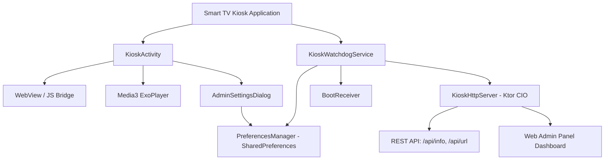

# 📺 Smart TV Kiosk (Android TV)

<p align="center">
  
  
  
  
  
</p>

**Smart TV Kiosk** — это профессиональное Android TV приложение для трансформации любых телевизоров, дисплеев и интерактивных панелей под управлением **Android TV / Google TV / Fire TV** в надежные терминалы самообслуживания, рекламные медиа-стойки (Digital Signage) и веб-киоски.

---

## ✨ Ключевые возможности (Features)

### 🔒 1. Полная системная блокировка (Lock Task Mode / Device Owner)
- **Device Policy Controller (DPC)**: Интеграция с Android Device Policy Manager.
- **Блокировка системных клавиш**: Перехват и блокировка кнопок `Home`, `Back`, `Recents` и `Settings` на пультах Smart TV.
- **Блокировка шторки уведомлений**: Запрет вызова системного меню и настроек Android TV.

### 🌐 2. Полноэкранный Web Kiosk (HTML5 Engine)
- **Современный WebView**: Поддержка HTML5, JavaScript, DOM Storage, WebGL, IndexedDB.
- **JavaScript Bridge (`window.SmartKiosk`)**: Управление функциями киоска прямо из веб-приложения (перезагрузка, очистка кэша, телеметрия).
- **Оффлайн-режим (Offline Fallback)**: Автоматическое обнаружение потери Wi-Fi/Ethernet и мягкое восстановление при появлении сети.

### 🎥 3. Digital Signage Media Player
- **Зацикленный проигрыватель**: Встроенный **AndroidX Media3 ExoPlayer** для зацикленного воспроизведения промо-видео роликов в 4K/1080p.

### 🌐 4. Удаленное управление и REST API (Embedded Web Admin)
- **Встроенный Ktor HTTP-сервер**: Приложение запускает собственный локальный веб-сервер (по умолчанию на порту `8080`).
- **Удаленная веб-панель**: Доступ с любого смартфона/ПК в той же сети для управления киоском.
- **REST API**:
  - `GET /` — Веб-панель администратора.
  - `GET /api/info` — Телеметрия TV (модель, версия Android, uptime, статус LockTask).
  - `POST /api/url` — Динамическая смена стартовой веб-страницы на ТВ.
  - `POST /api/reload` — Перезагрузка текущей страницы.
  - `POST /api/clearcache` — Очистка кэша браузера.

### 🕹️ 5. Smart TV Пульт & Защита PIN-кодом
- **Навигация DPAD**: Полный контроль фокуса для работы без сенсорного экрана.
- **Секретная комбинация вызова Админки**: Нажатие `5x ВВЕРХ` на пульте ДУ вызывает диалог ввода PIN-кода.
- **Автозапуск при включении (Boot Completed)**: Приложение и служба запускаются автоматически при подаче питания на телевизор.

---

## 🏗️ Архитектура проекта



---

## 🚀 Быстрый старт и установка

### 1. Сборка проекта
Клонируйте репозиторий и соберите APK с помощью Gradle:

```bash
git clone https://github.com/nrkfo/smartkiosk.git
cd smartkiosk
./gradlew assembleDebug
```

Итоговый APK файл будет находиться по адресу:  
`app/build/outputs/apk/debug/app-debug.apk`

---

### 2. Установка на Android TV через ADB

Подключитесь к вашему Smart TV по сети:

```bash
adb connect <IP_АДРЕС_ТЕЛЕВИЗОРА>:5555
adb install -r app/build/outputs/apk/debug/app-debug.apk
```

---

### 3. Назначение прав Device Owner (Активация режима блокировки)

Для полной блокировки системных клавиш и обеспечения максимального уровня безопасности киоска назначьте приложение владельцем устройства:

```bash
adb shell dpm set-device-owner com.smartkiosk.tv/.dpc.KioskAdminReceiver
```

> [!IMPORTANT]
> Если на устройстве уже заведен профиль пользователя, перед выполнением команды сбросьте устройство до заводских настроек или удалите существующие аккаунты.

---

## 🛠️ Удаленное управление (Web Remote Admin)

После запуска приложения на телевизоре откройте браузер на компьютере или телефоне в той же сети:

```text
http://<IP_АДРЕС_ТЕЛЕВИЗОРА>:8080
```

### Примеры запросов к REST API

#### Получить телеметрию устройства:
```bash
curl http://<IP_АДРЕС_ТЕЛЕВИЗОРА>:8080/api/info
```

*Ответ:*
```json
{
  "model": "Xiaomi Mi TV",
  "sdk": 31,
  "startUrl": "https://google.com",
  "kioskEnabled": true,
  "isDeviceOwner": true,
  "uptimeSeconds": 3600
}
```

#### Сменить отображаемый URL на ТВ:
```bash
curl -X POST http://<IP_АДРЕС_ТЕЛЕВИЗОРА>:8080/api/url -d "url=https://my-kiosk-app.com"
```

#### Перезагрузить веб-страницу на ТВ:
```bash
curl -X POST http://<IP_АДРЕС_ТЕЛЕВИЗОРА>:8080/api/reload
```

---

## 📜 JavaScript Bridge API (`window.SmartKiosk`)

Веб-приложения, загружаемые внутри киоска, могут напрямую вызывать функции Android:

```javascript
// Перезагрузить страницу
window.SmartKiosk.reload();

// Очистить кэш браузера
window.SmartKiosk.clearCache();

// Получить данные об устройстве
const info = JSON.parse(window.SmartKiosk.getDeviceInfo());
console.log(info.model, info.appVersion);

// Открыть меню настроек с проверкой PIN-кода
window.SmartKiosk.openAdmin("0000");
```

---

## 🛠️ Технологический стек

- **Language**: [Kotlin](https://kotlinlang.org/)
- **UI & Layouts**: Android TV Leanback & Custom Views with DPAD Focus
- **Video Signage Engine**: [AndroidX Media3 ExoPlayer](https://developer.android.com/guide/topics/media/media3)
- **Embedded Web Server**: [Ktor CIO Server](https://ktor.io/)
- **DPC / Security**: Android DevicePolicyManager & LockTask API

---

## 📄 Лицензия

Проект распространяется под лицензией **MIT**. Вы можете свободно использовать и модифицировать код в коммерческих и личных целях.
